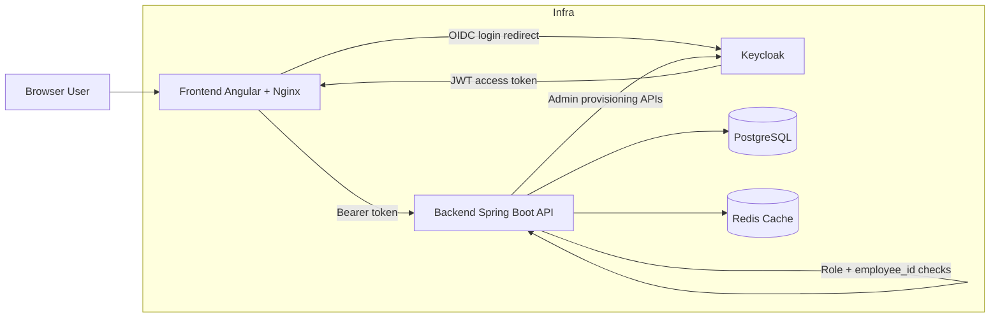

# Architecture

## 1) High-level component diagram



### Component responsibilities

- Frontend: user interface, route guards, token usage, API calls.
- Backend: business rules, validation, authorization, termination enforcement, data persistence.
- PostgreSQL: source of truth for employee records.
- Redis: short-lived read caching for selected employee reads.
- Keycloak: identity provider, token issuer, role model, admin provisioning target.

## 2) API contract summary

Base path: `/api/v1/employees`

### Create employee (HR admin)

- `POST /api/v1/employees`
- Auth: `ROLE_HR_ADMIN`

Example request:

```json
{
  "firstName": "John",
  "lastName": "Doe",
  "jobTitle": "Engineer",
  "dateOfBirth": "1990-01-01",
  "gender": "Male",
  "dateOfHire": "2024-01-01",
  "dateOfTermination": null,
  "homeAddress": "{\"line1\":\"10 Main St\",\"city\":\"Austin\"}",
  "mailingAddress": "{\"line1\":\"PO Box 10\",\"city\":\"Austin\"}",
  "telephoneNumber": "+1-555-0100",
  "emailAddress": "john.doe@company.local"
}
```

Example response (`201`):

```json
{
  "id": "f5e4c0f6-3f77-4a5c-bcbf-333333333333",
  "employeeId": "EMP-900001",
  "firstName": "John",
  "lastName": "Doe",
  "jobTitle": "Engineer",
  "emailAddress": "john.doe@company.local",
  "dateOfHire": "2024-01-01",
  "dateOfTermination": null
}
```

Notes:

- Backend generates `employeeId` in `EMP-######` format.
- Backend provisions/updates Keycloak user by **email-based username** and syncs account enabled state from termination status.

### Get employee details

- `GET /api/v1/employees/{employeeId}`
- Auth: `ROLE_HR_ADMIN` or owning `ROLE_EMPLOYEE`

Example response (`200`):

```json
{
  "id": "f5e4c0f6-3f77-4a5c-bcbf-333333333333",
  "employeeId": "EMP-900001",
  "firstName": "John",
  "lastName": "Doe",
  "jobTitle": "Engineer",
  "dateOfBirth": "1990-01-01",
  "gender": "Male",
  "dateOfHire": "2024-01-01",
  "dateOfTermination": null,
  "homeAddress": "{\"line1\":\"10 Main St\",\"city\":\"Austin\"}",
  "mailingAddress": "{\"line1\":\"PO Box 10\",\"city\":\"Austin\"}",
  "telephoneNumber": "+1-555-0100",
  "emailAddress": "john.doe@company.local",
  "createdAt": "2026-02-28T19:00:00Z",
  "updatedAt": "2026-02-28T19:00:00Z"
}
```

### Update employee (full)

- `PUT /api/v1/employees/{employeeId}`
- Auth: `ROLE_HR_ADMIN`

### Patch contact data

- `PATCH /api/v1/employees/{employeeId}/contact`
- Auth: `ROLE_HR_ADMIN` or owning `ROLE_EMPLOYEE`

Example request:

```json
{
  "homeAddress": "{\"line1\":\"101 New Street\",\"city\":\"Austin\"}",
  "mailingAddress": "{\"line1\":\"PO Box 10\",\"city\":\"Austin\"}",
  "telephoneNumber": "+1-555-0101"
}
```

Note: `emailAddress` cannot be changed once created; including it in contact patch returns `400`.

### Search employees (paginated)

- `GET /api/v1/employees/search?employeeId=EMP-900001&page=0&size=25`
- `GET /api/v1/employees/search?lastName=Doe&page=0&size=25`
- Auth: `ROLE_HR_ADMIN`

Behavior:

- At least one of `employeeId` or `lastName` is required.
- If both are provided, `employeeId` takes precedence.
- `employeeId` is exact match, case-insensitive.
- `lastName` is partial match, case-insensitive.

Example response (`200`):

```json
{
  "content": [
    {
      "id": "f5e4c0f6-3f77-4a5c-bcbf-333333333333",
      "employeeId": "EMP-900001",
      "firstName": "John",
      "lastName": "Doe",
      "jobTitle": "Engineer",
      "emailAddress": "john.doe@company.local",
      "dateOfHire": "2024-01-01",
      "dateOfTermination": null
    }
  ],
  "pageable": { "pageNumber": 0, "pageSize": 25 },
  "totalElements": 1,
  "totalPages": 1,
  "size": 25,
  "number": 0
}
```

## 3) Data model and field tradeoffs

Primary employee fields were chosen to support:

- legal identity and staffing operations (`firstName`, `lastName`, `employeeId`),
- HR lifecycle (`dateOfHire`, `dateOfTermination`),
- communication (`telephoneNumber`, `emailAddress`),
- profile completeness (`dateOfBirth`, `gender`, addresses),
- auditability (`createdAt`, `updatedAt`).

### Address modeling tradeoff: text in app layer, JSONB in DB

Current implementation:

- DB columns are `jsonb` (`home_address`, `mailing_address`) for shape flexibility.
- Java entity currently maps them as `String` fields containing JSON text.

Why this is acceptable now:

- avoids tight coupling to an address object schema while API evolves,
- supports storing structured address payloads without schema churn.

Tradeoffs:

- validation of internal address shape is weaker in the backend,
- JSON query/filtering is less ergonomic when app layer treats values as text.

Upgrade option:

- introduce typed `Address` value object in backend and map via JSON converter,
- keep DB `jsonb`, add server-side address schema validation,
- version API carefully to preserve backward compatibility.

## 4) Authentication and authorization flow

### Login and token flow

1. User opens frontend.
2. Frontend redirects to Keycloak for login.
3. Keycloak returns JWT access token containing roles and `employee_id` claim.
4. Frontend calls backend with `Authorization: Bearer <token>`.

### Role verification in backend

- Backend validates JWT issuer/signature as resource server.
- `KeycloakJwtAuthenticationConverter` maps `realm_access.roles` to `ROLE_*` authorities.
- Method-level authorization (`@PreAuthorize`) gates each endpoint.

### employee_id claim to DB record mapping

- Backend principal includes `employee_id` claim.
- Ownership rules compare path `employeeId` with `authentication.principal.employee_id`.
- This prevents employees from reading/updating other employee records.

### Termination handling

- `TerminatedEmployeeFilter` runs after authentication.
- It loads employee by `employee_id` and checks `dateOfTermination`.
- If terminated (`<= today`), request is denied with `403` and `reason: terminated`.
- On terminated requests, filter also attempts `setUserEnabledByEmail(email, false)` so Keycloak account is disabled for future logins.

## 5) Deployment notes

### Key environment variables

Backend runtime:

- `SPRING_DATASOURCE_URL`, `SPRING_DATASOURCE_USERNAME`, `SPRING_DATASOURCE_PASSWORD`
- `KEYCLOAK_ISSUER_URI`
- `KEYCLOAK_ADMIN_SERVER_URL`, `KEYCLOAK_ADMIN_REALM`, `KEYCLOAK_ADMIN_CLIENT_ID`, `KEYCLOAK_ADMIN_CLIENT_SECRET`
- `REDIS_HOST`, `REDIS_PORT`
- `KEYCLOAK_ADMIN_RETRY_MAX_ATTEMPTS`, `KEYCLOAK_ADMIN_RETRY_WAIT_DURATION`, `KEYCLOAK_ADMIN_RETRY_BACKOFF_MULTIPLIER`

Infra runtime:

- Keycloak admin bootstrap (`KEYCLOAK_ADMIN`, `KEYCLOAK_ADMIN_PASSWORD`)
- Postgres credentials (`POSTGRES_DB`, `POSTGRES_USER`, `POSTGRES_PASSWORD`)

### DB migrations

- Flyway migrations are executed on backend startup.
- Migration scripts live under `backend/src/main/resources/db/migration`.
- Migrations must be forward-only and idempotent for repeated environment startup.

### Upgrade path and backward compatibility

Recommended approach:

- Prefer additive API changes first (new optional fields, new endpoints).
- Keep existing response fields stable; avoid breaking renames/removals.
- Introduce deprecation window before removing legacy fields.
- Sequence rollout:
  1. deploy schema migration (backward compatible),
  2. deploy backend reading/writing both old/new shape if needed,
  3. deploy frontend using new fields,
  4. clean up deprecated columns/fields in a later release.

This minimizes client breakage during rolling deployments.
